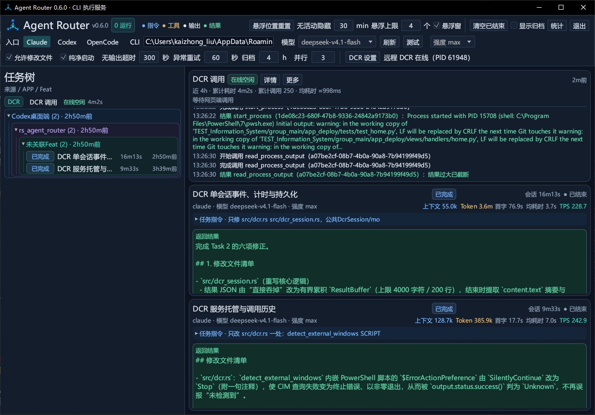
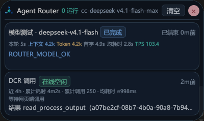

# Agent Router 0.6.0 — CLI 任务路由与 DCR 远程调用监控

Windows 桌面工具：统一管理 Claude / Codex / OpenCode CLI 任务，并托管 Desktop Commander Remote，让网页端 AI 的本机文件、终端和进程调用可见、可追踪。

社区项目，与 OpenAI、Anthropic、Desktop Commander 及其他 CLI/模型供应商无官方隶属关系。

[查看截图](#界面预览) · [DCR 能力、前置条件与使用方法](#desktop-commander-remotedcr) · [Windows 构建产物](https://github.com/smallcat2333/rs_agent_router/actions)

## 下载与独立构建

可在已成功完成的 Windows CI 运行中下载 `rs_agent_router-windows-x64` 构建产物。运行时按用途安装 CLI 或 Node.js，详细要求见下方 DCR 前置依赖。

从源码构建需要 Windows 10/11 x64、Rust stable、MSVC C++ 构建工具及 Windows SDK。此 GitHub 仓库已内置 `vendor/cli-stream`，不需要相邻仓库：

```powershell
cargo test --locked
cargo build --release --locked
.\target\release\rs_agent_router.exe show
```

构建和单元测试不要求登录模型供应商；实际使用 CLI 时需自行安装、登录并在 AR 配置。仓库不包含本机账号、代理凭据或运行记录。

## 贡献与许可

原创代码采用 [MIT License](LICENSE)，参与方式见 [CONTRIBUTING.md](CONTRIBUTING.md)，内置依赖来源及许可证见 [THIRD_PARTY_NOTICES.md](THIRD_PARTY_NOTICES.md)。

Harness 只分配工作，Rust App 决定执行 CLI、模型、强度、权限和超时。服务负责启动、输出、状态、取消和留痕；界面仅用于配置与监控，不维护聊天输入框、消息气泡或自建聊天历史。

## 界面预览

主页面：配置执行入口与 DCR 服务，在同一任务列表查看 Router 任务及 DCR 调用、日志、结果和窗口统计。



悬浮窗：主窗口隐藏后，仍可查看任务状态和 DCR 调用摘要；所有卡片按最近活动排序。



截图来自 2026-09-16 的实际运行界面；模型名、路径和统计数值仅为当时配置示例。

## 使用

在 RustRover 直接 Run 打开管理页，选择 **Claude / Codex / OpenCode CLI**，填写模型和强度。设置修改后自动保存并用于后续任务，无需额外点击保存；已运行任务保留原快照。GLM 是模型名称，不是独立 CLI。

模型下拉框支持刷新：Claude 读取 CC Switch 当前供应商配置，Codex 在后台查询所选 CLI 的模型目录；“测试”按当前配置创建独立的“模型测试”分组任务。强度按 `assets/model_efforts.json` 的本地维护表显示，含资料来源和核对日期，不随刷新联网查询；切换模型时不支持的旧档位恢复默认。Claude 使用 `--effort`，Codex 使用 `model_reasoning_effort`；“默认”表示不覆盖原 CLI 默认值。超时默认 300 秒，归档默认 4h，顶部设置修改后自动记忆。

OpenCode 首次选择时自动定位本机 npm 安装的 CLI；通过 `opencode models --verbose` 获取 `provider/model` 和原生 variant，不套用 Claude/Codex 强度表。使用 `run --format json`、stdin 提示词及 `--session` 续聊；认证沿用 CC Switch 写入的 OpenCode 配置。只读任务通过 `OPENCODE_PERMISSION` 拒绝编辑和 Bash，可编辑任务开放对应能力，不传 `--auto`。共享现有排队、取消及无输出超时；纯净启动与异常重试时限仍仅用于 Claude。原生错误直接回传，Token 用量来自 step_finish；未提供可靠流式耗时的 TPS 显示未知。执行模型通过本轮 messageID 对应的 `opencode export` 元数据确认，提交前缀为 `[ar-oc-provider-model-variant]`，缺少 variant 或身份时不猜测。

强度表于 2026-09-14 按厂商文档、本机 Codex `model/list` 和 OpenCode 官方模型目录核对。Muse Spark 1.3 标准版最高 `max`，1.3 Contributor 根据用户当前渠道的回执与明确要求开放 `max`；Grok 4.6 最高 `xhigh`；Qwen 3.8 的有效档位为 `low/medium/xhigh`。API 的 `none/minimal`、思考开关、token 预算和同义映射不列为当前 CLI 的额外强度。Codex 的 `ultra` 包含自动任务委派，不能当作通用 API 档位；厂商能力与具体供应商支持范围可能不同，详见各模型 tooltip。菜单与参数验证不证明上游实际采用该强度。

每个新任务固定当时的 App 配置快照。已有任务的原生会话复用原快照，避免中途更换 CLI。Harness 请求不能包含 backend、model、effort、allow_edits、timeout_seconds。

```text
rs_agent_router.exe show
rs_agent_router.exe submit --request task.json --wait
rs_agent_router.exe status --task-id T001
rs_agent_router.exe health --task-id T001
rs_agent_router.exe cancel --task-id T001
```

需要给同一小任务补充指令时，可选地复用原 CLI 保存的上下文：

```text
rs_agent_router.exe send --task-id T001 --message-file instruction.txt --wait
```

使用进程 API 逐项传参，并读取 stdout JSONL 和 stderr。`--wait` 默认只输出最终摘要（最多 800 字符）、结果路径、执行模型证据和指标，过程在本地消费、供 App 展示与日志留痕。需要排障时才加 `--events` 查看完整过程，或用 `status --full` 查询完整记录；主 Harness 通常只审查实际差异与验收结果，失败或有疑点才读必要日志片段。

首次提交自动启动唯一管理实例；取消请求不等于已回收，需等待终态。客户端断开不会取消任务；失败不自动重试。并行时同时启动多个提交客户端，分别收结果；不要等完第一个再提交第二个。

## 工作协议

复制 `task.example.json`，仅包含 task_id、title、group_path、workdir、prompt。工作目录必须是已存在的绝对路径；任务 ID 唯一，重复 ID 不覆盖记录。

Skill 的分组固定为 **来源 → APP → Feat → 小任务叶子**：例如 `['Codex桌面端','rs_agent_router','Feat_执行服务']`。来源指发起工作的 Harness，不是执行模型。没有 Feat 时用“未关联Feat”。协议允许零至三级分组，Skill 提交必须完整填写三级。

stdout 事件：accepted、progress（仅 --events）、finished、status、health、cancel_requested、shown、error。非等待提交退出 0 只表示接收成功；`--wait` 仅在本次执行 succeeded 时退出 0。GPT/Harness 必须另外核对文件差异和验收结果。

结果的 `executor` 返回 CLI、请求模型、报告模型、强度、取值来源及 `commit_prefix`。Router 任务审计通过后按 `[ar-cc-模型-强度]` / `[ar-cx-模型-强度]` 记录执行来源；主 Harness 可以串行代提交，直接实现仍用项目原前缀。模型切换后任务顶部及提交归属采用最后有效回复模型，保留请求模型和冲突标记供核对。App 配置值不证明代理实际路由；通用别名、合成错误消息不能证明模型，缺少实际模型或强度时前缀为空，不猜身份。程序不会自动提交代码。

## 监控与留痕

顶部“悬浮窗”开关打开半透明无边框置顶卡片，宽度 360，默认最多显示 4 个对话；顶部“悬浮上限”可设置为 1–20 并自动记忆。高度按对话数计算，超过屏幕高度时滚动查看。Windows 原生窗口不透明度约 75%，外层圆角 24；卡片属于同一管理器，不单独占任务栏。总标题栏显示当前新任务配置，如 cc-glm-5.3-max、cx-gpt-5.6-luna-max；已运行任务仍沿用启动时配置。顶部可拖动，“清空”只清理已结束任务，右上角 × 关闭。首次绘制后显示，不主动抢焦点；关闭卡片不影响主窗口和任务执行。主窗口隐藏到托盘后，卡片仍独立刷新。任务树行前显示固定宽度圆角状态卡：运行绿色、完成蓝色、超时黄色、失败或中断红色，主动取消灰色。

“清空已结束”移除所有非运行任务（含归档），保留运行任务及磁盘日志；仅作持久化的列表隐藏标记，不删除数据库记录、不释放旧任务 ID。

- 左侧显示任务名、状态、紧凑耗时（25s / 2m2s / 4h3m）及距最近活动时间（如 5h2m前）；分组时间取最新子任务。正文与日志不放进树行。
- 右侧最多展示最近活动三个任务，铺满分配区域；顶部“归档”后面的“并行”数值框默认 3，超出上限的任务按提交顺序排队，使用紫色状态标签。排队不计执行耗时或无输出超时，可取消；降低上限不抢占运行任务，提高上限自动补齐名额。退出会取消排队任务，异常重启按中断留痕，不自动重跑。
- Claude 顶部“纯净启动”默认勾选并自动保存，新会话使用 `--safe-mode`，不自动加载用户和项目 CLAUDE.md、技能、插件等定制；认证及工具权限沿用 CLI，Router 执行约束仍保留。Codex 暂不接入；已有任务续聊或返工沿用创建时快照，不能清除历史上下文。
- 面板顶部右侧显示上下文 Token、本轮总 Token、首字/首段耗时、累计会话耗时与进程健康；悬停查看精确用量和统计口径。CLI 没提供的指标显示 —，不以累计 Token 估算上下文。
- 首字指从 CLI 启动到首次可见文本抵达；非流式输出标为「首段」，不冒充 API TTFT。会话耗时不计轮次间等待。
- 深蓝灰主题；来源/APP/Feat 使用蓝/紫/青区分，指令蓝色、工具琥珀色、正文高对比、结果绿色、失败红色。辅助工具与诊断文本折叠展示。
- 详情查看请求、日志、结果，Esc 关闭；查看操作不更新活动时间。
- 任务右键可归档或删除；组标题右键可删除当前列表中该组及子组的已结束任务，保留运行任务。删除只移出列表，日志和 ID 占用保留。
- 完成满配置的归档时长后移入归档视图，默认四小时，不移动或删除日志；重启使用相同规则。
- 主面板和悬浮窗显示本任务最近 5 次完整回复的均耗时，跨续聊和返工保留；悬停查看各条耗时和计时来源。
- 主面板和悬浮窗的第二行末尾显示输出 TPS（Token/s），不计输入、缓存和工具执行耗时。Claude 按本轮主模型完整响应流的输出用量与流时长计算，不含首字等待和子代理；Codex 按本轮输出用量除以排除并行工具区间后的模型阶段时长计算，包含请求等待，以 `≈` 标识近似值。用量或完整计时边界缺失时显示 `—`，旧记录不回填估算。悬浮窗左上角复用主窗口应用图标。
- 最小化隐藏到托盘；有运行任务时退出需二次确认。确认后结束进程树，并向 Harness 返回 manager_shutdown。

SQLite 保存任务元数据。任务根目录保留稳定的最新 result.json；各次执行保存到 `turns/0001/`、`turns/0002/` 等，包含请求、启动参数、原始 stdout/stderr、事件和结果。CLI 自己保存原生上下文，服务只记录其 session_id。

旧 0.2 任务不移动日志；已有 GLM 元数据在数据库备份后显示为 Claude+原模型。旧版未保存 CLI 会话，不能追加指令，只能查看记录或新建小任务。异常重启将未完成执行标记 interrupted，不自动重跑。

## 健康与超时

`health` / `health --task-id <ID>` 被动探活，3 秒内返回管理器 PID、版本、运行数量及工作线程/子进程状态。探活不启动管理器、不调用模型、不改变任务活动时间；服务不可达为 manager_unavailable，无响应为 health_check_timeout，均非零退出。

顶部“无输出超时”按任务启动时的配置快照执行，默认 300 秒：首次从 CLI 启动开始计时，每次标准输出或错误日志出现非空内容时重新计时；持续输出不限制任务总时长。连续静默达到阈值后终止进程树，回收并保存结果后返回 timed_out / idle_timeout。Harness 不另设截止时间或根据探活结果杀任务。管理页确认退出后返回 manager_shutdown，取消该任务的等待客户端收到非零码。

Claude 的“异常重试”数值框默认 60 秒，自动保存并写入任务快照；每轮独立记录 `claude-debug.log`。检测到 CLI 的 API 重试错误或流式失败转非流式重试后，改用首次异常起算的专用时限，重复错误、心跳及工具输出不延长；正常模型内容恢复后解除，继续使用普通无输出超时。到期终止进程树并返回 `timed_out / retry_timeout`；CLI 自行成功、失败或用户取消时仍及时结束。只匹配本任务已验证的调试日志事件，不读取 CC Switch 全局日志判定任务，也不修改 CLI 内部重试次数。Codex 保持原行为。

## 构建与配置

```powershell
cargo build --release
```

使用仓库内置的 `vendor/cli-stream`（上游提交 cd42566aab9e21903e96b4d59ab7e674f7fb415d，MIT OR Apache-2.0），不自建 LLM 工具循环。内置依赖保留原许可证，无需相邻仓库即可构建。

首次启动时，调试构建读取项目目录 router.local.json，Release 读取 exe 同目录配置，记录根目录默认为 exe 同目录 runs；可通过 --config / --runs-dir 指定位置。之后从 exe 同目录 startup.json 恢复上次使用的配置和任务目录，显式启动参数可覆盖；已有实例通过 App 保存设置，客户端不能临时替换它。

认证沿用 CLI/CC Switch，配置不保存密钥。Claude 的写权限仅开放 Read/Glob/Grep/Edit/Write，不开放 Bash；Codex 使用 read-only/workspace-write。任务需要的目录、文件范围和项目规则由 Harness 写入工作描述。

用户提供的原图在 assets/app.png，EXE、窗口和托盘图标均已接入。只有重新生成图标资产时需要 Python/Pillow：`python assets/prepare_icon.py assets/app.png`，正常 Cargo 构建不需要 Python。

## Web 统计

主窗口点击“统计”打开本机页面。按创建日期、CLI、配置模型、来源/APP/Feat、执行状态及审计状态筛选；图表、摘要和分页明细采用同一数据集。模型汇总忽略大小写，默认包含归档、不含已删除任务。

明细展示累计执行耗时、Token、当前评分、返工次数、本轮首字/首段与最近五次回复均耗时；点击会话可查看逐轮评分依据、返工与审计关联、回复计时样本及结果路径。评分由 Harness 经 review 提交，页面只读；未评分与未知用量保持“—”，不会作为零分或零消耗。

`cargo test --offline --bin rs_agent_router write_web_statistics_fixture` 生成 `target/web-statistics-fixture.json`。浏览器验收函数位于 `tests/statistics.browser.js`，在隔离 HTTP 预览页验证分页、筛选、评分历史、返工、空结果、断线恢复与窄屏布局，测试数据不写入实际任务库。

## 验证与 Skill

`cargo test --offline --bin rs_agent_router`、`cargo clippy --offline --all-targets -- -D warnings`。

Rust 测试中的 service 用例通过独立命名管道运行真实 Windows 替身进程，验证并发、探活、超时和进程回收，可以与用户的管理页同时运行。`verify-failures.ps1` 使用无网络替身验证桌面生命周期；`verify.ps1` 用真实 CLI 验证 App 路由、原生上下文与写入；随后 `verify-ui.ps1` 检查监控页、Esc 与图标。后三个脚本需要专用临时实例，先确认已有管理页没有工作并关闭它，不能中断正在执行的用户任务。

调用端可依据本节工作协议组织任务；本仓库不依赖开发机器上的 Skill 路径。

## 变更记录

2026-09-09 | 0.6.0 | 主面板与悬浮窗新增最近 5 次完整模型回复的平均耗时，跨续聊/返工保留，悬停显示各条耗时及来源；Claude 有 ttft_ms 时统计等待加响应，否则仅记录响应流时长；Codex 使用排除工具阶段的 CLI 回复周期，非中转站精确 API 耗时。旧记录缺少边界时显示未知，不回填估算值。

2026-09-09 | 0.1.0 | 三入口单任务调用与日志。

2026-09-09 | 0.2.0 | 统一管理页、任务树、IPC、归档、托盘与 Skill。

2026-09-09 | 0.3.0 | 收窄为 CLI 执行服务：App 控制 CLI/模型/强度，Harness 仅分配小任务；精简监控页、右键归档/删除、修正铺满与 Esc，接入用户图标；只复用原 CLI 上下文，不维护聊天客户端。

2026-09-09 | 0.4.0 | 默认精简 Harness 返回，新增被动健康检查与独立超时计时器、执行模型/强度来源及 ar 提交标识；丰富任务树配色、活动时间和面板指标；Skill 按依赖并发派发，主 Harness 审计并串行维护共享档案及提交。

2026-09-09 | 0.5.0 | 紧凑布局：设置行水平对齐并按字段分隔，任务树单行左对齐，收紧执行面板纵向间距；设置即时自动保存；新增可开关、可拖动、按任务数量收缩的半透明无边框置顶卡片。

2026-09-09 | 0.6.0 | 合并审计评分、返工计数与本机统计页；悬浮卡片使用原生透明度、大圆角和工具窗标记；新增清空已结束任务，保留运行任务、元数据与日志。

2026-09-09 | 0.6.0 | 悬浮卡片关闭按钮改为淡红色圆形底、深红色 × 图标，保持原有关闭交互。

2026-09-09 | 0.6.0 | 完成模型目录刷新与测试、本地模型强度表、启动目录及顶部设置记忆、可配置归档、任务状态卡及组删除；修复任务标题重复悬浮提示，补齐最近五次回复平均耗时与逐条来源展示。

2026-09-09 | 0.6.0 | 悬浮窗默认上限改为 4 个对话，主窗口顶部可设置数量并自动保存；悬浮窗总标题栏显示当前配置的 cc/cx-模型-强度并随设置同步更新。

2026-09-09 | 0.6.0 | 超时由整个任务总时长改为连续无输出时长，CLI 标准输出和错误日志的非空内容均刷新计时；补充持续输出、停止输出、启动静默及进程树回收验证。

2026-09-09 | 0.6.0 | 完成 Web 统计交互验收，增加审计状态筛选、首字/首段与最近回复均耗时、逐条计时来源和返工审计关联；合并模型大小写分组，修正未知评分及空结果样式，新增可重复浏览器验收。

2026-09-10 | 0.6.0 | 主界面新增悬浮无活动隐藏分钟数并自动记忆，默认 30 分钟；已结束任务分别到期隐藏，运行任务不受影响，主界面与归档不变。悬浮窗以当前底边为基准向上扩展或向下收缩，拖动后以新位置为基准；隐藏滚动条，模型测试不再自动打开日志详情。

2026-09-10 | 0.6.0 | 顶部新增悬浮位置重置，将悬浮窗居中到主窗口并显示；自动记忆主窗口正常尺寸和悬浮窗底边位置，重开恢复。最近活动距今改为整分钟显示，不足一分钟显示 0min前。

2026-09-10 | 0.6.0 | 悬浮任务卡片压缩为四行，状态和活动时间移到标题行，本轮耗时、首字及均耗时合并到指标行；主界面均耗时紧随首字，模型下拉框加高至 360。无活动隐藏设置移到顶部；任务模型显示及提交前缀采用最后有效回复模型，忽略合成错误占位值，补充模型映射与切换验证。

2026-09-11 | 0.6.0 | 允许编辑的 Claude 任务开放 Bash 用于必要自测，只读任务不变；每轮自动附加自测和精简回传约束，默认报告文件清单、实际测试命令及结果、最小失败证据。Skill 要求主 Harness 按风险检查差异并保留必要独立验收，避免例行读回完整代码日志和重复全部测试；约束不扩大原任务授权，不保证模型必然遵循。

2026-09-11 | 0.6.0 | 主窗口隐藏时悬浮窗主体鼠标穿透，清空和关闭仍可点击，保持亮度；修复重绘切换穿透状态打断点击，移除悬浮窗全部 tooltip。模型菜单显式提供十行可见高度并绘制三角箭头，避免字体缺字；活动距今显示 h/m，不显示秒。通过 9 项 UI 测试及 Release 编译。

2026-09-13 | 0.6.0 | 主界面和悬浮窗第二行末尾新增输出 TPS，Claude 按完整响应流统计，Codex 扣除并行工具执行区间并标注近似值，缺失用量或计时显示未知；悬浮窗左上角新增现有应用图标，保留标题拖动与清空、关闭按钮交互。

2026-09-14 | 0.6.0 | 强度下拉菜单在滚动区外显式设置弹层高度，支持同时显示十行选项，超过十行可滚动选择；通过 cargo check --offline --bin rs_agent_router。

2026-09-14 | 0.6.0 | 更新模型强度表及来源，复核 GPT/Claude/GLM/Kimi/DeepSeek，补全 Muse、Grok、Qwen 3.8、Hy 等目录型号；区分 Muse 标准版与 Contributor，说明供应商差异，仅有开关或预算的型号保留默认；补充版本边界及强度参数验证。

2026-09-14 | 0.6.0 | 按用户当前渠道的 max 回执开放 Muse Spark 1.3 Contributor 的 max 档位，保留免费版与旧版边界，更新来源说明与 CLI 参数测试。

2026-09-14 | 0.6.0 | 主页面新增默认勾选的 Claude 纯净启动，在归档后新增默认 3 的并行数值框；任务执行模式固定快照，超额任务按提交顺序排队并显示紫色标签，支持取消、动态限额及退出清理，排队不计执行超时。68 项测试通过（4 项显式环境测试跳过），Clippy 通过。

2026-09-15 | 0.6.0 | 执行输出正文增加灰色本地时间与耗时前缀，例如 2:13:22(2m1s)；下一条正文到达后固定上一条耗时，当前条目动态累计至任务结束，工具日志不打断计时。新增渲染回归测试；本机 GNU 工具链无法生成导入库，运行测试尚未完成。

2026-09-15 | 0.6.0 | 悬浮窗增加原生置顶恢复计时器，层级丢失或被其他置顶窗覆盖时无需打开主界面即可恢复，不抢焦点；隐藏时停止维护。补充置顶丢失、同层覆盖及隐藏回归断言；语法与差异检查通过，运行测试受本机 GNU 工具链阻断，尚未完成。

2026-09-15 | 0.6.0 | Claude 主页面新增默认 60 秒的异常重试时限；逐轮捕获 CLI API 错误及流式降级重试，首次异常起算、重复报错不续期，恢复输出后解除，到期按 retry_timeout 终止进程树。真实 Claude 本机模拟 500 / SSE 错误验证日志格式，71 项测试通过（4 项环境测试跳过），Clippy 通过。

2026-09-15 | 0.6.0 | 新增 OpenCode CLI 入口，读取原生 provider/model 目录与 variant，支持 JSON 事件、会话续聊、读写权限、Token 用量及原生消息模型身份。指定 opencode-go/muse-spark-1.3-contributor 实测约 3.4 秒返回地区不可用错误，AR 正常终止；该模型真实读写与续聊验收受上游限制，尚未完成。

2026-09-15 | 0.6.0 | 主页面顶部调整为三行：标题与操作按钮、CLI/模型/强度选择、执行与悬浮配置；第三行集中显示权限、超时、归档、并行和悬浮设置。cargo check 与 Clippy 通过，新版布局尚未构建 Release。

2026-09-22 | 0.7.0 | 新增 Antigravity (agy) CLI 入口，支持 stream-json 事件输出；执行配置栏增加启用代理勾选与 SOCKS5 代理地址输入 (ip:port)，启用后为 agy 子进程注入 HTTP_PROXY/HTTPS_PROXY/ALL_PROXY 环境变量；项目从 Tools/supporttools 迁移至独立 GitHub 仓库。

2026-09-23 | 0.7.0 | Antigravity 刷新改为执行 `agy models`，启用代理时带上 SOCKS5；启动不再把 `-p` 后的参数当提示词，改为 stdin 文本加 stream-json，并按 agy 的 event 结果判定成功。

2026-09-23 | 0.7.0 | 去掉「代理地址为空」误报。SOCKS5 框里的 127.0.0.1:11808 原先只是占位符，保存值仍是空串；勾选代理且地址为空时写入该地址。

2026-09-23 | 0.7.0 | Antigravity 的均耗时和 TPS 改用完成回复步骤的 duration_seconds；TPS 分子为输出 Token 加思考 Token，不含启动等待和工具步骤。旧记录不回填。

2026-09-23 | 0.7.0 | 勾选允许修改文件的 Antigravity 任务追加 `--dangerously-skip-permissions`。无头模式不能弹权限框，否则读文件被拒绝且正文为空；结果里的 denied_actions 不再记为成功。

### Desktop Commander Remote（DCR）

#### 能力与前置依赖

AR 可托管 Desktop Commander Remote，将网页端的本机工具调用统一显示在主页面和悬浮窗中，提供连接状态、实时日志、结果摘要，以及归档窗口内的累计耗时、累计调用和均耗时。网页端仍通过 DCR 自身的远程 MCP 接入，不需要把 AR 的本地接口暴露到公网。

**DCR 能做什么？** 网页端 AI 可通过 Desktop Commander 读取和修改本机文件、搜索项目内容、启动命令、读取进程输出并与长运行进程交互。AR 负责托管连接及展示调用，不替代网页端 AI，也不把多个网页聊天识别为不同会话；当前所有调用汇总为一个“DCR 调用”卡片。工具范围和可用性以 Desktop Commander 配置、当前用户权限及网页客户端支持为准。参见 [Desktop Commander 官方介绍](https://desktopcommander.app/mcp/)。

- **运行环境**：Windows，安装 Node.js **18 或更新版本**（固定 DCR 0.2.50 的包声明要求）；`node`、`npm`、`npx.cmd` 必须能从 AR 的 PATH 找到。安装 Node.js 后需重新启动 AR，以刷新环境变量。
- **网络**：首次启动由 npx 获取 `@wonderwhy-er/desktop-commander@0.2.50`，需要访问 npm 仓库；运行时需要访问 DCR 的远程认证及实时连接服务。使用代理时，先确保设置中的代理可用；默认 `http://127.0.0.1:11809` 是本机配置值，AR 不负责启动代理服务。
- **网页端接入与授权**：网页客户端须支持远程 MCP，并完成 Desktop Commander 的连接配置及设备授权。首次授权提示可在“DCR 调用”的会话详情中查看；仅启动 AR 不会自动完成网页端连接。
- **常驻与权限**：本机保持联网，AR 和 DCR 服务保持运行；工具以当前 Windows 用户权限访问文件和执行命令。工作目录必须存在；由 AR 托管前需结束手动启动的 DCR，避免重复实例。
- **CLI 为可选依赖**：仅使用 DCR 工具无需安装 Claude/Codex/OpenCode；若网页端还需派发 Router 开发任务，则必须安装并登录对应 CLI，在 AR 中配置模型、权限和强度。CC Switch 不是 DCR 的必需依赖。
- **从源码构建**：需要 Rust/MSVC 构建环境及 Windows SDK；本仓库的 `cli-stream` 已内置于 `vendor/cli-stream`，可独立构建，无需下载相邻项目。使用已构建 Release 不需要 Rust 工具链。

#### 使用与统计

首次使用按下面步骤操作：

1. 安装 Node.js，重新启动 AR。在终端执行 `node --version`、`npm --version`、`npx --version`，确认命令可用。
2. 若已用脚本手动运行 DCR，先结束该实例。在 AR 顶部打开 **DCR 设置**，选择存在的工作目录，并按自己的网络填写出站代理；不使用代理时可清空该项。
3. 点击 **启动**。AR 会通过 npx 获取固定版本并启动远程服务；首次下载、认证或连接可能需要等待。“连接中”仅表示尚未确认在线，不等同于失败。
4. 如需登录，打开主页面 **DCR 调用 → 详情** 查看授权地址或设备码，在浏览器完成授权。通过 [Desktop Commander 远程服务门户](https://mcp.desktopcommander.app/) 按所用网页 AI 客户端的指引配置远程 MCP，并确认设备在线；AR 的代理地址不是网页端 MCP 地址。
5. 状态变为 **在线空闲** 后，在网页对话中先发起一次只读测试，例如：“使用 Desktop Commander 的 get_file_info 获取指定文件的信息，不执行文件。”主页面和悬浮窗会显示调用及返回摘要；后续读写或终端操作由网页端发起。
6. 可勾选 **随 AR 启动**，日常将主窗口隐藏到托盘即可。需要断开时到 DCR 设置点击 **停止**；关闭悬浮窗或清空卡片不会停止 DCR，退出 AR 会结束其托管的 DCR 进程。

常见问题：找不到 `npx.cmd` 时检查 Node.js 安装及 PATH；首次启动长时间连接中时先查看 DCR 会话详情，检查下载、代理和授权状态；提示外部实例存在时先关闭手动运行的 DCR。本机进入休眠、网络断开或退出 AR 后，网页端不能继续使用该托管连接。

顶部第三行的“DCR 设置”管理网页端本机连接：启动、停止、随 AR 启动、出站代理和工作目录。首次使用需完成 Desktop Commander 自身的设备授权；启动依赖 Node.js/npm，使用固定版本 `@wonderwhy-er/desktop-commander@0.2.50`。代理仅传给 DCR 子进程，不修改 Windows 用户环境。关闭 AR 时清理 AR 启动的 DCR；原来手动启动的实例不会被接管或结束。

主页面任务树、任务卡片和悬浮窗使用同一个“DCR 调用”会话，汇总 AR 托管进程的所有网页调用及连接日志。它与普通任务按最近有效活动混排，共用展示数量和无活动隐藏设置；在线空闲不算运行任务，正在调用时不因无活动隐藏。卡片显示连接状态、工具名称、并发数量及统计窗口内的累计耗时、累计调用、均耗时，不显示模型、Token、TPS 或评分。

统计窗口跟随顶部“归档”时长，默认滚动最近 4 小时，而非从启动起的全量累计。累计耗时裁剪到窗口内的忙碌区间，并发重叠只算一次，空闲不计；累计调用按返回时刻计数，包含失败返回，不包含中断或远端认领跳过。均耗时是窗口内返回样本从收到请求到返回的平均时间；同名并发按 FIFO 配对时显示 `≈`。过期样本会剔除，增大窗口不会找回已剔除的历史；旧版无时间明细的聚合量不带入新窗口。数据随独立快照保存，重启保留窗口内记录。

独立展示快照保存在运行记录目录的 `dcr-session.json`，重启恢复日志但不恢复运行中状态；旧 `.claude-server-commander/tool-history.jsonl` 仅首次作为历史导入，不虚构实时耗时。清除和归档只隐藏展示，不停止 DCR，新调用到达后重新显示同一个会话。工具返回不代表其启动的后台进程已结束；该汇总会话不识别网页聊天归属，不进入 CLI 并行调度或 Token 统计。

网页端需要将开发工作交给 AR 时，通过 DCR 写入 UTF-8 工作 JSON，例如：

```json
{
  "task_id": "web-example-001",
  "title": "检查指定文件",
  "group_path": ["ChatGPT网页端", "目标APP", "未关联Feat"],
  "workdir": "C:/absolute/project",
  "prompt": "仅检查指定文件并返回摘要，不修改文件。"
}
```

再通过 DCR 执行 `<AR完整路径> submit --request <JSON绝对路径>`，取得 task_id 后以 `status --task-id <ID>` 查询；长任务不要使用 `--wait` 持有网页工具调用。任务直接进入主页面任务树，执行配置取 AR 当前设置；断线后查询原 ID，不能重复提交。DCR 直接读写文件或执行命令不会自动成为 AR 任务，也不受 AR 的 CLI 权限和并行设置控制。

2026-09-16 | 0.6.0 | 接入 DCR 服务启停、随 AR 启动、子进程代理与工作目录设置，并在主页面提供连接日志和最近工具调用记录；每次启动后台检测外部实例，取消与重启隔离状态，历史有界读取。16 项 DCR 针对性测试、主页面配置持久化测试与 Clippy 通过，Release 已构建；保留现有手动 DCR，真实远程登录与网页调用尚未验收。

2026-09-16 | 0.6.0 | 将悬浮位置重置、无活动隐藏、悬浮上限和悬浮窗开关移到顶部第一行；第三行保留执行及 DCR 配置。cargo check 通过。

2026-09-16 | 0.6.0 | DCR 调用汇总为独立单会话，接入主页面任务树、卡片、详情与悬浮窗，按最近活动混排并共用展示上限；顶部仅保留 DCR 设置。新增实时调用状态、并发忙碌区间计时、连接及结果摘要、独立快照恢复，清除/归档不停止服务。29 项相关测试、cargo check 与 Clippy 通过；真实网页调用待新版 Release 验收。

2026-09-16 | 0.6.0 | 修正 DCR 长日志越界，统一主卡片、详情与悬浮窗文案和时间格式；增加均耗时及累计调用，统计跟随归档时长按滚动窗口计算，跨界忙碌区间裁剪、过期样本剔除。补充 DCR 能力、Node.js/npm、网络代理、网页授权及源码构建依赖说明。33 项相关测试与 Clippy 通过，Release 已构建；主页面和悬浮窗视觉已检查，真实网页调用验收尚待完成。

2026-09-16 | 0.6.0 | 补充主页面与悬浮窗实机截图、DCR 文件/终端/进程能力说明及首次使用步骤；悬浮窗等待提示缩至 10px，收紧行间距，为结果摘要留出空间。同步至独立 GitHub 仓库，保留内置依赖、许可证及 Windows CI。

2026-09-16 | 0.6.0 | 修复 Desktop Commander 0.2.50 分段读取文件后遗留句柄，导致 Qt Designer 替换保存失败的问题：AR 启动 DCR 时加载限定于其文本读取模块的流清理修复，并传递到 MCP 子进程，读取返回前等待文件关闭。不修改 npm 缓存、系统环境或用户设计文件；已有 DCR 进程不会被自动重启，修复在新版 AR 下次启动 DCR 时生效，不能回收旧进程已泄漏的句柄。可用 `node --test tests/dcr-read-stream-guard.cjs` 验证提前结束、完整读取、异常/取消和子进程传播；已用实际安装包及临时文件验证 Qt QSaveFile 替换保存成功。
